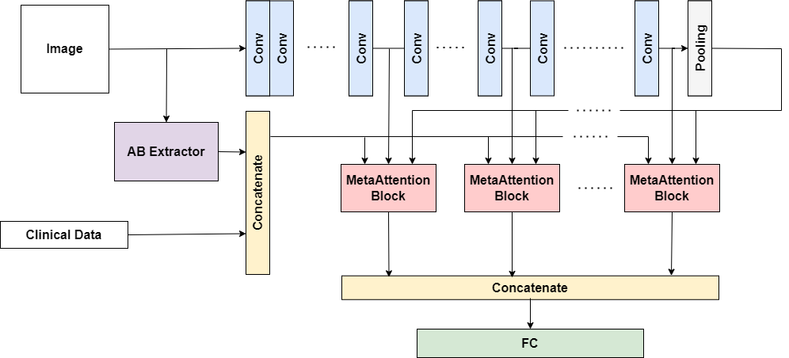
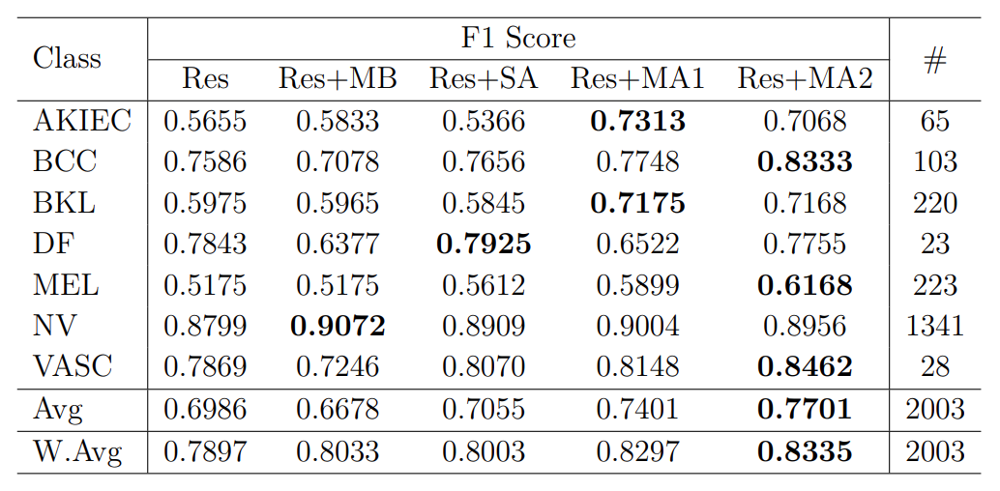
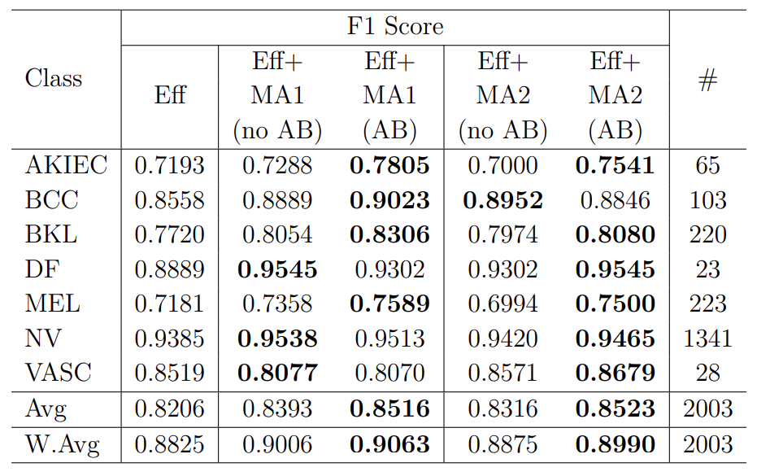
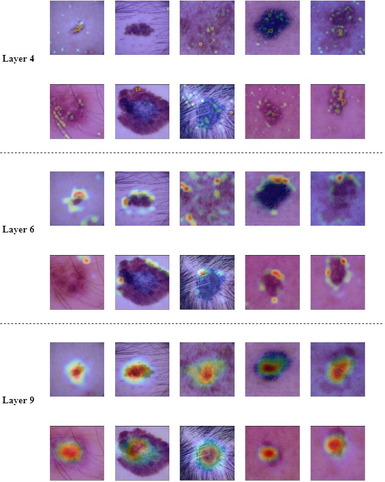

# MetaAttention model: A new approach for skin lesion diagnosis

This is the code base for the models in "MetaAttention model: A new approach for skin lesion diagnosis"
(Hung To Duy, Huy Nguyen Gia, Hang Le Thi Thuy, Hung Le Minh and Tho Quan Thanh)

## 
Documentation

## The MetaAttention architecture

  

  <b>Figure 1:</b> Overview concept of proposed model

## The AB Extractor Block

| No. | Step | Input | Output | Function |
| ------------------------------------------------------------------------------------ | --------------------- | -------------------- | ------------------------------ | ----------------------------------- |
| 1 | Image preprocessing | Skin lesion image | Contrast-enhanced and denoising image | Remove usual noise objects on the skin (like hair) and equalize histogram of the image |
| 2 | Image segmentation | Output of step 1 | The main region of interests | Extract useful information to locate and delineate the lesion region from preprocessed image |
| 3 | AB features extraction | Output of step 2 | Asymmetry index and Compact index | Extract Asymmetry index and Compact index, which represent AB features from the skin lesion region |

## 
Models

## Dataset

The dataset using in the paper is [HAM10000](https://www.nature.com/articles/sdata2018161)

## Usage

1. Train

`python train.py`

2. Test / inferenct

`python inference.py`

## 
Experimental results

## Quantitative results

  

  <b>Figure 2:</b> F1 score difference between MetaAttention with previous methods

  

  <b>Figure 3:</b> F1 score difference between AB Extractor block and non-AB Extractor block

## Qualitative results

Figure 4 display the attention heat maps from the EfficientNet-B4 model with
MetaAttention blocks after layers 4, 6, and 9. These attention maps are superimposed
on input images to show where the model is focusing. It can be observed that the deeper
the layer, the more complicated the features and the more detailed the attention map. If
we look at the attention map at layer 6 (Figure 4 middle), we can see that our proposed
model has detected and concentrated on the boundary of the skin lesions. At the last
layer, with the global features extracted, the MetaAttention block is able to help the
model eliminate all the noises and focus accurately on the abnormal part in the images.

  

  <b>Figure 4:</b> Attention maps in EfficientNet-B4 with MetaAttention blocks at layer 4
(top), layer 6 (middle), and layer 9 (bottom)

